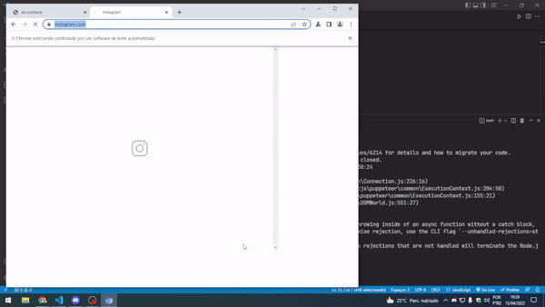

# BotSeguidor


> Automação para seguir uma lista de perfis no instagram.

## 💻 Tecnologias usadas

- [NodeJS](https://nodejs.org/en/)
- [Puppeteer](https://developers.google.com/web/tools/puppeteer)


## 🚀 Instalando BotSeguidor

Para instalar o **BotSeguidor**, siga estas etapas:


``` bash
yarn
```

ou

```bash
npm install
```

## ☕ Usando BotSeguidor

Para usar **BotSeguidor**, siga estas etapas:

**1. Rode o projeto**

``` bash
yarn start
```

ou

```bash
npm start
```


**2. Abra seu API Client (Postman/Insomnia/outro)**

**3. Crie uma nova requisição com os seguintes dados:**
- URL: http://localhost:3333/instagram
- Body (JSON): 

``` json
{
   "list": [
      "javascriptbr",
      "um-perfil-maneiro-qualquer"
   ],
   "username": "meu-usuario",
   "password": "minha-senha"
}
```

**4. Coloque seus dados e envie a requisição!**